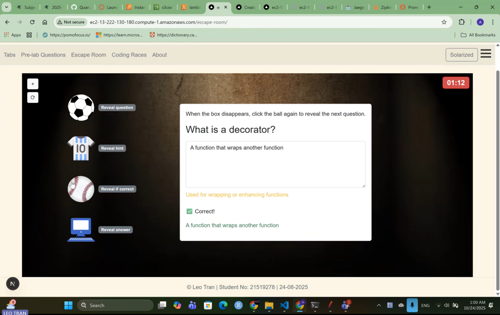
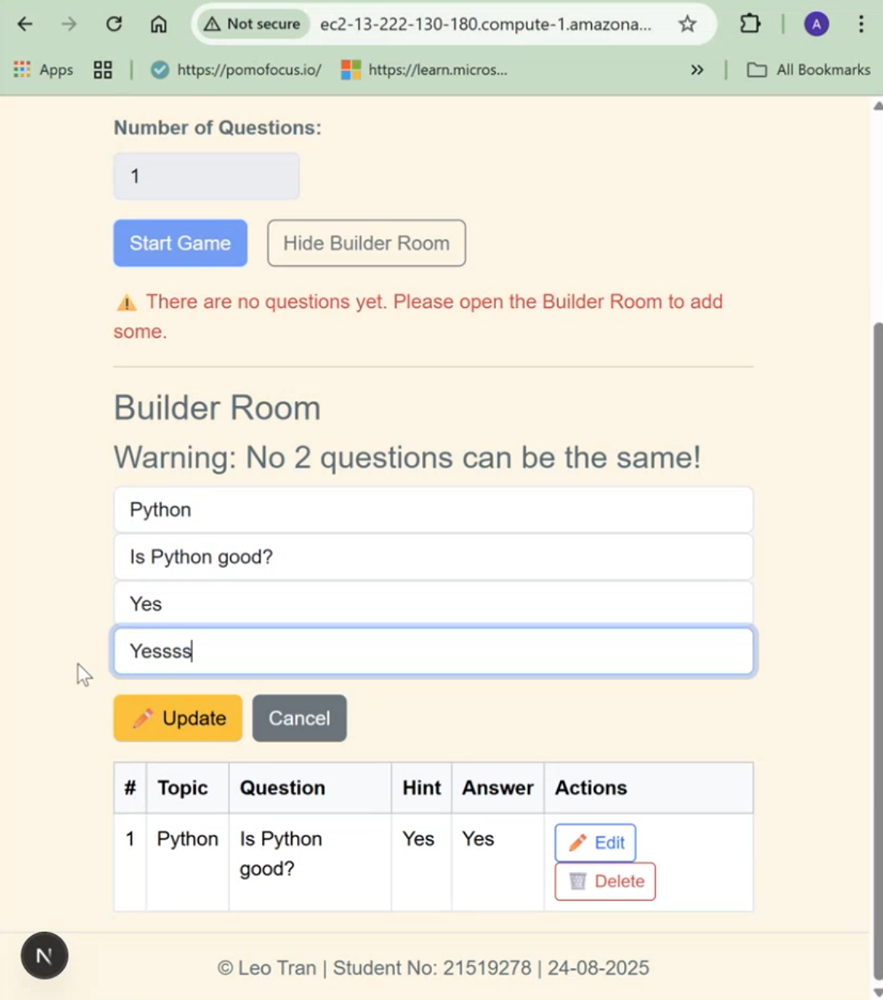
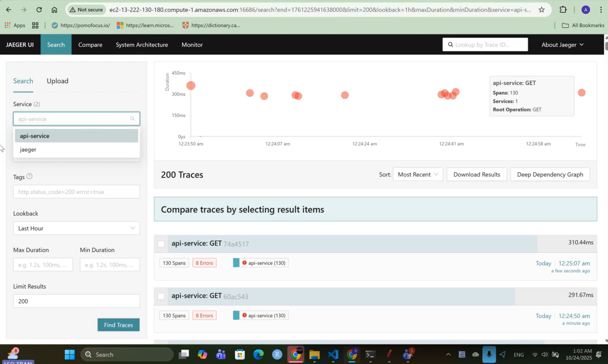
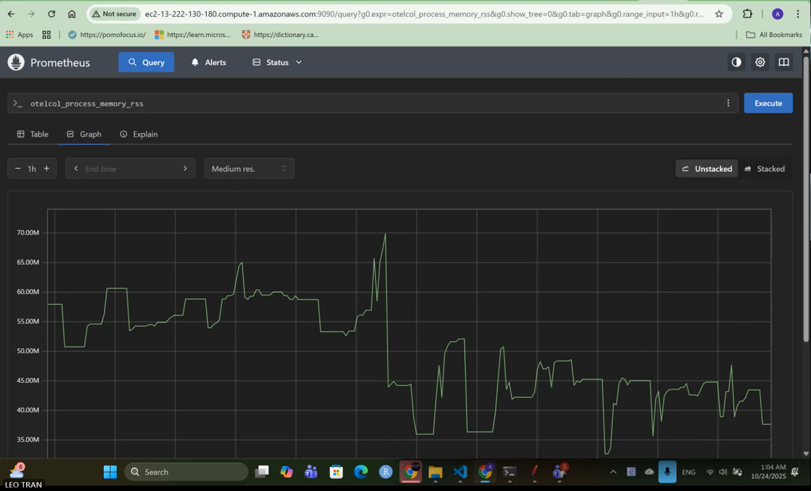

# Escape Room Web Application – Cloud, Observability & Testing


## Overview

This project is a full-stack web application that allows users to:

- play coding challenges in an interactive “Escape Room” environment  
- create, edit, and manage questions through a builder interface  

The system demonstrates modern software engineering practices, including:

- full-stack development
- containerised deployment
- cloud infrastructure (AWS)
- observability and monitoring
- automated testing

## Key Features

- Interactive Escape Room gameplay with timer and dynamic UI  
- Builder Room for CRUD question management  
- Cloud deployment on AWS EC2  
- Static hosting using AWS S3  
- Serverless dynamic HTML generation using AWS Lambda  
- Full observability stack (OpenTelemetry, Jaeger, Zipkin, Prometheus)  
- End-to-end and API testing using Playwright  

## Tech Stack

- Frontend: Next.js (App Router), React, TypeScript 
- Backend: Next.js API Routes + Sequelize ORM
- Database: SQLite
- Containerisation: Docker & Docker Compose
- Cloud: AWS EC2, S3, Lambda
- Static Hosting: AWS S3
- Serverless: AWS Lambda
- Observability:
  - OpenTelemetry
  - Jaeger (tracing)
  - Zipkin (tracing)
  - Prometheus (metrics)
- Testing: Playwright (API + UI)

## System architecture

- a Next.js frontend for user interaction and gameplay  
- a backend API layer for business logic and data handling
- a SQLite database accessed via Sequelize ORM  
- a containerised environment orchestrated with Docker Compose  
- a cloud deployment layer using AWS services  
- an observability stack for tracing and monitoring 

## Request Flow

```text
User interaction (frontend)
        ↓
HTTP request sent to backend
        ↓
Next.js API route handles request
        ↓
Sequelize queries SQLite database
        ↓
Response returned to frontend
        ↓
UI updates dynamically
```

## Deployment

### AWS EC2

Runs the full containerised system using Docker Compose, including:

- frontend service
- backend API
- observability stack

### AWS S3

Used for static hosting of the frontend.

### AWS Lambda

Used to generate dynamic HTML content, demonstrating serverless execution.

## Demo

- Frontend (S3 static site): [View Live Site](http://quantran-cwa-frontend-demo-613150164134-ap-southeast-2-an.s3-website-ap-southeast-2.amazonaws.com/)
- Lambda Function (dynamic HTML): [Invoke Lambda](https://brj6ie7pn3lwq2fz6lhpuf6tpq0cwcdo.lambda-url.ap-southeast-2.on.aws/)

## Screenshots

### Escape Room Gameplay
Interactive coding challenge with object-based mechanics.


### Builder Room (CRUD)
Create, update, and manage questions through a UI.


### Distributed Tracing (Jaeger)
End-to-end request tracing from API to database.


### Metrics Monitoring (Prometheus)
System metrics and performance monitoring.


## Observability & Monitoring
The backend API is fully instrumented using OpenTelemetry.

```text
Backend → OpenTelemetry SDK → OTEL Collector → Jaeger / Zipkin / Prometheus
```

This enables:

- distributed tracing of API requests
- monitoring of latency and system behaviour
- visibility into database interactions


## Testing
Automated tests were implemented using Playwright.

Test Coverage
- REST API tests (GET, POST, PATCH, DELETE)
- Duplicate-safe logic validation
- UI workflow test (Builder Room: add, edit, delete question)

Run tests locally or in CI
``` bash
npx playwright test
```

Tests are also executed in GitHub Actions CI.

## Docker Usage
Run the full system locally:
``` bash
docker-compose build
docker-compose up
```

Stop services:
``` bash
docker-compose down
```

## Project Structure
- frontend/ – Next.js frontend application
- api/ – backend API and database layer
- tests/ – Playwright API and UI tests
- docker-compose.yml – service orchestration
- otel-collector-config.yaml – telemetry configuration
- prometheus.yaml – metrics configuration

Author

Anh Quan (Leo) Tran
